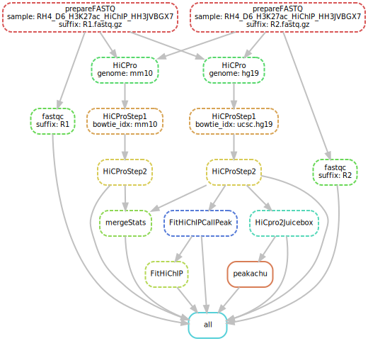

# khanlab_pipeline
This is the implementation of [KhanLab](https://ccr.cancer.gov/Genetics-Branch/javed-khan) NGS Pipeline using Snakemake.

Khanlab pipeline supports the following NGS data types:

1. [HiC-Pro](#headHiC)
2. [RNAseq](#headRNAseq)
3. [ChIPseq](#headChIPseq)
4. DNAseq

## Installation

The easiest way to get this pipeline is to clone the repository.

```
git clone git@github.com:hsienchao/khanlab_pipeline.git
```
This pipeline is available on NIH biowulf cluster, contact me if you would like to do a test run. The data from this pipeline could directly be ported in [OncoGenomics-DB](https://clinomics.ncifcrf.gov/production/public/), an application created to visualize NGS data available to NIH users.
## Requirements
[snakemake 5.13.0](https://snakemake.readthedocs.io/en/stable/)  
[mutt](http://www.mutt.org/)  
[gnu parallel](http://www.gnu.org/software/parallel/)  
SLURM resource management

### HiC:
- [HiCPro] (https://github.com/nservant/HiC-Pro)
- [JuiceBox] (https://github.com/aidenlab/Juicebox)
- [Bowtie2] (https://github.com/BenLangmead/bowtie2)


## Conventions

- Sample names cannot have "/" or "." in them
- Fastq files end in ".fastq.gz"

## Run pipeline

#### Input sample sheet

- Sample sheet in YAML format

##### Required columns

1. Genome (accepted values: hg19,hg38,mm10)
2. SampleFiles ( usually Sample_ + Library_ID + _ + FCID )
3. Other pipeline type specific columns

##### Example 

See examples in [HiC](#expHiC), [RNAseq](#expRNAseq) or [ChIPseq](#expChIPseq)

- Sample sheet in YAML format
- Sample sheet can be generated using script sampleToYaml.py. Usage:
```
python scripts/sampleToYaml.py -s [SAMPLE_ID] -o [OUTPUT_FILE]
```
Example:
```
python scripts/sampleToYaml.py -s RH4_Ent6_H3K27ac_HiChIP_HH3JVBGX7 -o RH4_Ent6_H3K27ac_HiChIP_HH3JVBGX7.hic.yaml
```

#### Launching the pipeline

##### 1. General launch script:

    launch [options]
	
    required options:

            -type|t         <string>        Pipeline type (available options: hic,chipseq,ranseq,dnaseq)
            -workdir|w      <string>        Working directory where all the results will be stored.
            -sheet|s        <string>        Sample sheet in YAML format

    optional options: 
            -datadir|d <string> FASTQ file location (default: /data/khanlab/projects/DATA) 
            -dryrun Dryrun only 
            -dag Generate DAG SVG

  * Example
```
      launch -type hic -w /data/khanlab/projects/HiC/processed_DATA -s /data/khanlab/projects/HiC/processed_DATA/sample_sheets/RH4_D6_H3K27ac_HiChIP_HKJ22BGX7.hic.yaml
```
#####  2. Launch by sample ID (Khanlab automation and regular Khanlab users):
```
    scripts/automate.sh [sampleID]
```    
    This script will parse the Khanlab master files to determine the sequencing type automatically. Then it will retrieve required columns from HiC/ChIPseq sample sheets and check if FASTQ files are ready. Then it will lauch the pipeline automatically.
    
    The Khanlab data location:
    
    -- FASTQ files: /data/khanlab/projects/DATA
    -- Processed data: /data/khanlab/projects/pipeline_production/processed_DATA
    -- Processed data: /data/khanlab/projects/pipeline_production/sample_sheets


  * Example 1: process HiC sample
```
   scripts/automate.sh RH4_Ent6_H3K27ac_HiChIP_HH3JVBGX7
```
  * Example 2: process RNAseq samples
```
   scripts/automate.sh NCI0215tumor_T_C2V4TACXX
```

## <a name="headHiC"></a>HiC

#### HiC sample_sheet

##### columns

1. Genome (hg19,hg38,mm10)
2. SampleFiles
3. SpikeIn (optional)
4. SpikeInGenome (optional)

## <a name="expHiC"></a>HiC Example:
```
samples:
  RH4_D6_H3K27ac_HiChIP_HKJ22BGX7:
    Genome: hg19
    SampleFiles: Sample_RH4_D6_H3K27ac_HiChIP_HKJ22BGX7
    SpikeIn: 'yes'
    SpikeInGenome: mm10
```
#### Output
1. Juicebox hic file: [output dir]/[sample_id].allValidPairs.hic
2. HiCpro pairs:
  * Pairs for the reference genome:
    * [output dir]/HiCproOUTPUT/hic_results/data/[sample_id]/[sample_id]/[sample_id].allValidPair
  * Pairs for the spikeIn genome:
    * [output dir]/HiCproAQuAOUTPUT/hic_results/data/[sample_id]/[sample_id]/[sample_id].allValidPair
  * Mergestat summary (reference and spike-In):
    * mergeStats.txt
  * Successful flag:
    * successful.txt

#### Dependency graph

##### DAG example with spike-In


##### DAG example without spike-In


### ChIPseq
Not implemented yet.

### ## <a name="headRNAseq"></a>RNAseq

#### RNAseq sample_sheet

##### Required columns

1. Genome (hg19,hg38,mm10)
2. SampleFiles
3. SampleCaptures (polya, polya_stranded, ribozero, access)
3. Xenograft       (optional)
4. XenograftGenome (optional)

## <a name="expHiC"></a>HiC Example:
```
samples:
  NCI0215tumor_T_C2V4TACXX:
    Genome: hg19
    SampleFiles: Sample_NCI0215tumor_T_C2V4TACXX
    Xenograft: 'yes'
    XenograftGenome: mm10
    SampleCaptures: ribozero
```
#### Output

##### STAR Output

1. Gencode STAR BAM: STAR_hg19_gencode/[sample_id].star.genome.bam
2. Gencode STAR BAM bigwig: STAR_hg19_gencode/[sample_id].star.genome.bw
3. UCSC STAR BAM: STAR_hg19_gencode/[sample_id].star.genome.bam
4. UCSC STAR BAM: STAR_hg19_gencode/[sample_id].star.genome.bw

##### RSEM Output

1. Gencode RSME genes: RSEM_hg19_gencode/[sample_id].hg19.genocde.genes.results
2. Gencode RSME isoforms: RSEM_hg19_gencode/[sample_id].hg19.genocde.isoforms.results
3. Gencode RSME genes: RSEM_hg19_ucsc/[sample_id].hg19.ucsc.genes.results
4. Gencode RSME isoforms: RSEM_hg19_ucsc/[sample_id].hg19.ucsc.genes.results

##### HLA Output

1. Seq2HLA and HLAminer combined file: HLA/[sample_id].Calls.txt

##### Xenograft filtered FASTQ (for Xenograft samples)

1. DATA/classification.tsv: Filtering summary
2. DATA/[sample_id].filtered_R1.fastq.gz
3. DATA/[sample_id].filtered_R2.fastq.gz

#### Dependency graph

##### DAG example


##### DAG example for Xenograft samples


### DNAseq
Not implemented yet.
### Methylseq
Not implemented yet.
## Rulegraph


For questions or comments, please contact: Hsien-chao Chou (chouh@nih.gov)